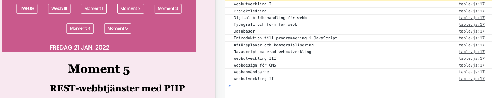

# educationApp

## dt173g_moment5_steg2 

### Skapande av en fristående publik webbapplikation som konsumerar REST-webbtjänsten courses_api 

#### Obligatorisk funktionalitet:
* Läsa ut listan över kurser/alla poster.
* Skapa formulär som gör det möjligt att lägga till ny kurs/post.

### Följande funktionalitet ska finnas i lösningen för godkänt:
1. Webbapplikationen ska använda Fetch API för att hämta (GET) och skicka data (POST) från och till webbtjänsten.

2. Lösningen ska skapas med enbart HTML, CSS och JavaScript (ej PHP). SASS ska användas för din CSS.

3. Lösningen ska publiceras till publikt tillgänglig webbhost.

4. Källkoden ska publiceras till ett online repository som exempelvis Github eller Git bucket.

5. Det ska finnas en README-fil som ger en beskrivning av din webbapplikation samt inkluderar en webblänk till din publicerade webbplats för testkörning.

#### Frivillig funktionalitet:
* möjlighet att uppdatera informationen om en kurs/post i listan.
* möjlighet att radera kurs/post i listan.

### GRUND
I steg 2 av moment 5 har jag använt git, gulp och flera andra npm paket, VSC samt VSC terminalen samt testkört i webbläsaren Chrome genom tillägget Browser-sync. 

    Då jag hade tyvärr inte gjorde båda delarna under samma period så var jag tvungen att gå tillbaka och säkerställa att versionerna var uppdaterade innan jag gick vidare med steg 2 och utvecklade webbapplikationen. NPM version 8.1.2 är den som använts. Information om resterande versioner finns i filen **package.json** 

    Bestämde tidigt att applikationen skulle heta educationApp och att den skulle publiceras som en del av webbplatsen där alla moment finns med. 

Jag klonade därför ner min källkod för moment 4 i kursen då jag ville använda liknande utseende och navigation under alla kursens delmoment. Källkoden justerades utifrån moment 5 t.ex. adderade jag en ny knapp med länk så att repo till både Steg 1 och Steg 2 finns med. Dessutom justerades huvudmenyn och under arbetets gång även sidans layout.

### DEL 1

    Hämta och läsa ut mina kurser:

Jag påbörjade arbetet lokalt som jag nämnt tidigare. Mitt första steg var att skapa JavaScriptfilen **table.js** där jag i stora drag följde videon där Malin visar hur man enkelt konsumerar ett REST-api med hjälp av Fetch. Började med en grundvariabel **coursesEl** och en händelslyssnare som triggar funktionen getCourses när sidan laddas. Funktionen använder Fetch för att hämta alla kurser som är sparade i mitt api [courses-api](https://www.frida360.se/courses-api/api). Jag testade detta först i konsollen. Se bild nedan: 

.

För att kunna visa kurserna i applikationen testade jag med att lägg in tomma elementen som p(paragraf) och li(listobjekt) i filen index.html. Slutligen valde jag att göra en tabell för kurserna och lämnande **tbody** elementet tomt. Det fungerade med p och li men tyckte det såg tydligast ut med en tabell. I **table.js** filen adderade jag även en "Radera kurs" och en "Uppdatera kurs" knapp per tabellrad, som jag återkommer till senare. 
 

    Lägga till en ny kurs: 

I filen **index.html** skapade jag ett fomulär samt en knapp för att lägga till/skicka den nya kursen till mitt REST-api. Därefter skapade jag variabler, händelselyssnare och funktioner i filen **forms.js**. När knappen "Lägg till kurs" klickas så triggas funktionen addCourse som tar de värden som finns i formuläret och skickar dessa till courses-api. 

### DEL 2
I steg 2 av moment 5 har jag enbart använt mig av HTML, JavaScript och SCSS för min CSS. Jag har använts en enkel mappstruktur för respektive CSS område - Base, Components, Layout som länkas samman i en huvud stilmall: **_main.scss**.

### DEL 3
Publiceringen gjordes genom mitt webbhotell hos Inleed samt FileZilla (ftp överföring av filer) och därefter testkördes allt igen i webbläsaren Chrome. Länk till min publicerade webbapplikation: 
[https://www.frida360.se/educationApp/](https://www.frida360.se/educationApp/)

### DEL 4
* Länk till mitt repo där alla källkodsfiler som använts finns:  
[https://github.com/frla1901/dt173g_moment2.git](https://github.com/frla1901/dt173g_moment2.git)  

### DEL 5

